# 여기모여

> 라이브 방송을 보며 공동구매와 한정판매에 참여하는 라이브커머스 플랫폼

한정 수량 상품에 구매 요청이 동시에 몰려도 **서버에 도착한 순서대로 결제 기회가 제공되고, 준비된 수량보다 많이 판매되지 않도록** FIFO 구매 대기열과 재고 예약 시스템을 구현했습니다.

| 구분 | 내용 |
| --- | --- |
| 개발 기간 | 2026.09.16 ~ 2026.10.06 |
| 개발 인원 | 1명 |
| 담당 범위 | 기획, UI, 프론트엔드, 백엔드, DB 설계, 외부 API 연동 |
| 핵심 주제 | 동시성 제어, 초과 판매 방지, 매크로·미결제 악용 방지 |

## 프로젝트 목표

라이브커머스 한정판매에서는 짧은 시간에 많은 구매 요청이 들어옵니다. 단순히 결제 완료 순으로 판매하면 네트워크와 결제 속도가 빠른 사용자에게 유리하고, 여러 사용자가 결제를 진행한 뒤 품절을 경험할 수 있습니다.

여기모여는 구매 요청을 먼저 접수해 순서를 확정하고, 순번이 된 사용자에게만 재고를 임시 확보합니다. 결제 완료 전후의 재고 상태를 분리하고 DB 잠금으로 갱신을 직렬화하여 초과 판매를 방지했습니다.

## 핵심 구매 처리 흐름

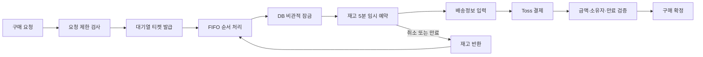

### FIFO 구매 대기열

- 구매 요청마다 티켓을 발급하고 티켓 번호 순서대로 처리합니다.
- `WAITING → PROCESSING → RESERVED → CONFIRMED` 상태를 구분해 관리합니다.
- 구매자에게 현재 순번, 앞선 요청 수, 남은 수량을 표시합니다.
- 결제 속도가 아니라 구매 요청이 서버에 도착한 순서로 기회를 제공합니다.

### 동시성 및 초과 판매 방지

- JPA `PESSIMISTIC_WRITE` 비관적 잠금으로 같은 재고의 동시 갱신을 막습니다.
- 재고 확인과 임시 예약을 하나의 트랜잭션에서 처리합니다.
- 순번이 된 요청에만 재고를 5분간 확보합니다.
- 예약 만료 또는 구매 취소 시 다음 순번에게 재고를 자동으로 넘깁니다.
- Toss Payments 승인 후 서버가 주문 금액과 예약 상태를 다시 검증한 뒤 구매를 확정합니다.

### 매크로 및 악용 방지

| 안전장치 | 정책 |
| --- | --- |
| 사용자 요청 제한 | 사용자당 초당 3회 |
| IP 요청 제한 | IP당 초당 20회 |
| 구매 수량 제한 | 상품별 1인 최대 수량 적용 |
| 중복 요청 방지 | 활성 티켓 검사 및 `requestKey` 기반 멱등 처리 |
| 미결제 패널티 | 24시간 내 3회 만료 시 30분, 5회 만료 시 24시간 참여 제한 |
| Redis 장애 대응 | Fail-open 후 DB 락과 수량 제한으로 재고 정합성 유지 |

요청 제한은 Redis Lua Script로 카운트 증가와 만료 시간 설정을 원자적으로 처리합니다. 사용자가 직접 취소한 요청과 결제 실패는 미결제 패널티에 포함하지 않습니다.

## 주요 화면

### 구매 대기열과 안전장치

| FIFO 구매 대기열 | 반복 요청 제한 |
| --- | --- |
| 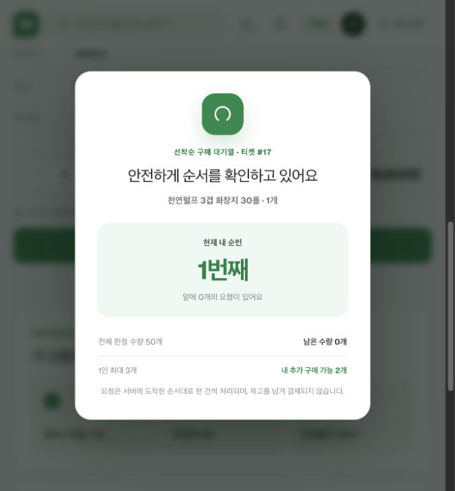 | 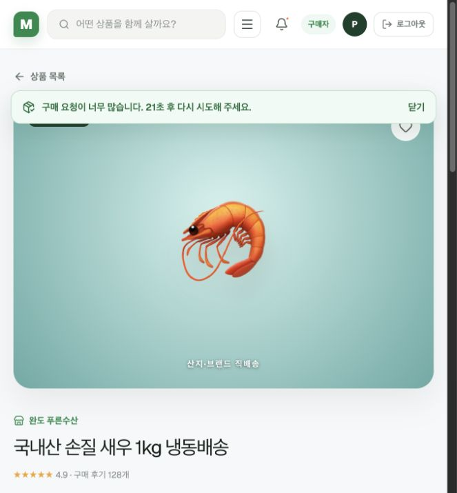 |

| 재고 임시 확보 | 배송정보 입력 |
| --- | --- |
| 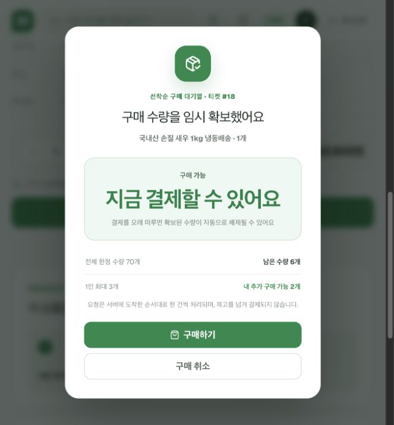 | 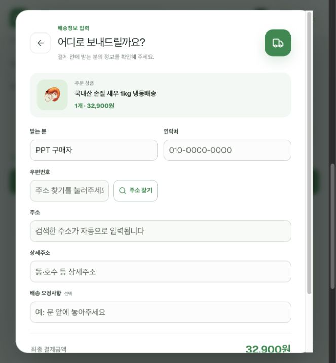 |

### 사용자별 화면

| 구매자 메인 | 한정판매 상세 |
| --- | --- |
| 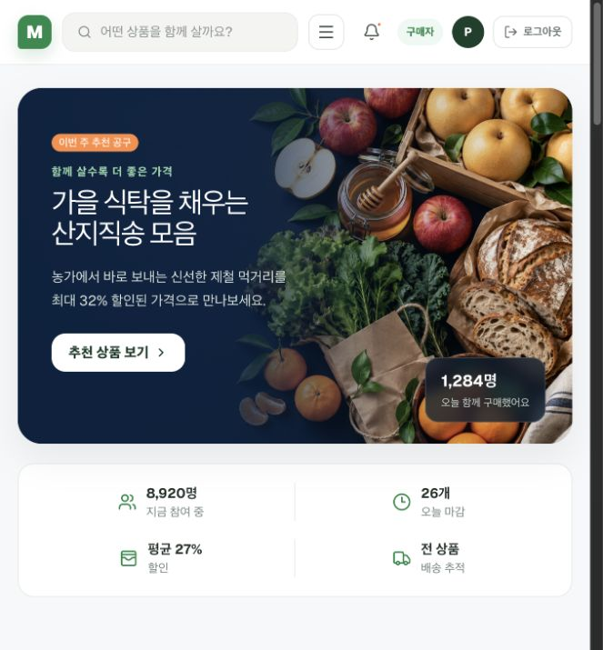 | 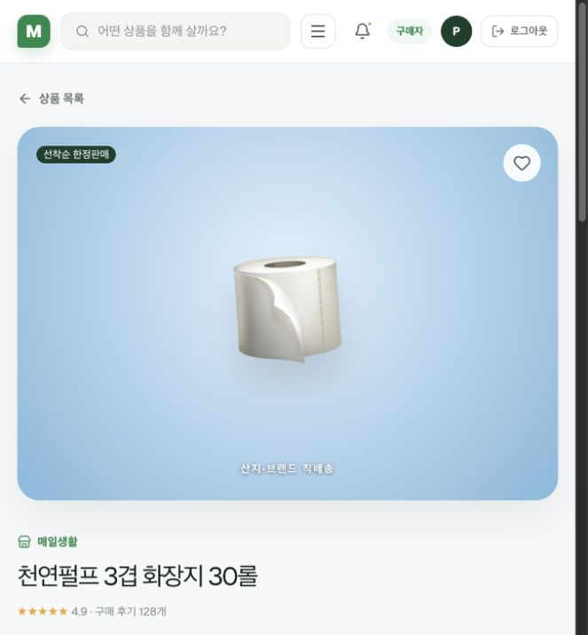 |

| 판매자센터 | 라이브커머스 |
| --- | --- |
| 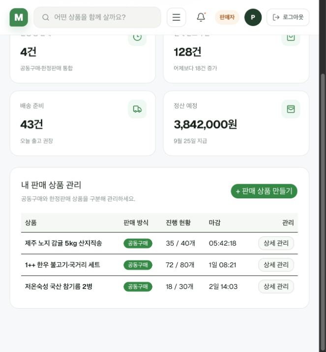 | 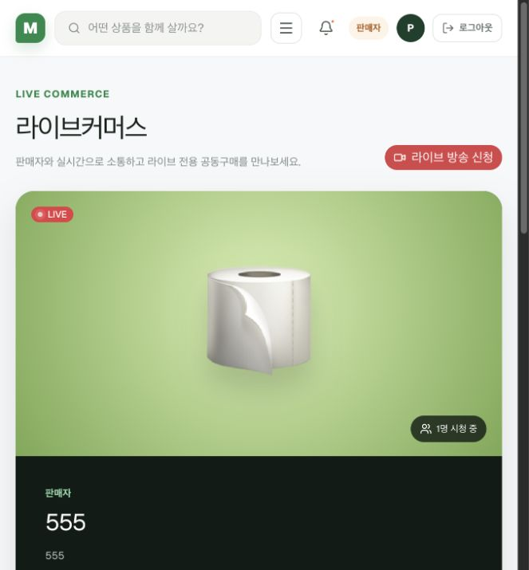 |

| 관리자센터 | 방송 승인 대기 |
| --- | --- |
| 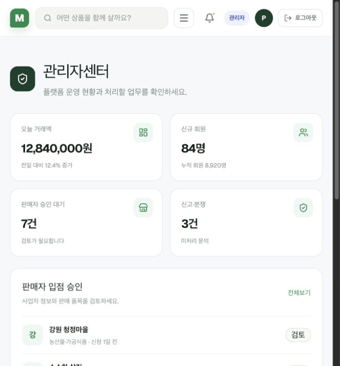 | 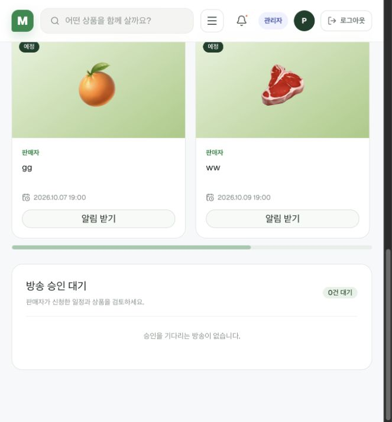 |

## 주요 기능

### 구매자

- 공동구매 및 한정판매 상품 조회·찜
- 구매 대기열 접수와 실시간 순번 확인
- 배송정보 입력 후 Toss Payments 결제
- 라이브 방송 시청 및 WebSocket 실시간 채팅
- 방송 알림 신청과 배송 조회
- Google·Kakao·Naver 소셜 로그인

### 판매자

- 공동구매·한정판매 상품 및 주문 현황 관리
- 라이브 방송 일정 신청과 승인 상태 확인
- OBS 송출 정보 확인 및 방송 상태 관리
- 배송·정산 현황 확인

### 관리자

- 판매자 입점 검토
- 라이브 방송 승인·반려와 반려 사유 관리
- 거래·회원·신고 현황 확인

## 시스템 구성

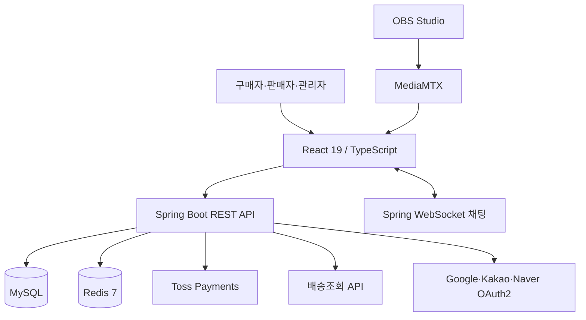

## 기술 스택

### Backend

- Java 25, Spring Boot 4.1
- Spring Data JPA, Spring Security, OAuth2 Client
- Spring WebSocket, Bean Validation
- Maven

### Frontend

- React 19, TypeScript 5
- Vite 8, Vinext
- Tailwind CSS 4, shadcn UI, Base UI

### Data and Infrastructure

- MySQL, Redis 7
- Docker, MediaMTX, OBS Studio

### External API

- Toss Payments
- Google·Kakao·Naver OAuth2
- 주소 검색 API
- 배송 조회 API

## 테스트

- `PurchaseQueueConcurrencyTest`: 동시 구매 요청에서 한정 수량만 예약되는지 검증
- `GroupBuyConcurrencyTest`: 동시 참여 요청에서도 공동구매 참여 수량이 정확하게 증가하는지 검증
- `MemberServiceTest`: 회원 가입과 인증 관련 서비스 로직 검증
- `HealthControllerTest`: 백엔드 상태 확인 API 검증

```bash
cd backend
./mvnw test
```

## 로컬 실행

### 1. MySQL 데이터베이스 생성

```sql
CREATE DATABASE live_group_buy
    CHARACTER SET utf8mb4
    COLLATE utf8mb4_unicode_ci;
```

### 2. Redis 실행

```bash
docker compose up -d redis
```

### 3. 백엔드 실행

```bash
cd backend
cp .env.properties.example .env.properties
./mvnw spring-boot:run
```

백엔드 상태 확인: `http://localhost:8080/api/health`

### 4. 프론트엔드 실행

```bash
cp .env.example .env.local
npm install
npm run dev
```

프론트엔드: `http://localhost:3000`

### 5. 라이브 미디어 서버 실행

```bash
docker run --rm --name mediamtx \
  -p 1935:1935 \
  -p 8888:8888 \
  -p 8889:8889 \
  -p 8189:8189/udp \
  bluenviron/mediamtx:1
```

OBS의 서버 주소는 `rtmp://localhost:1935`이며 스트림 키는 판매자 방송 관리 화면에서 확인합니다.

## 환경변수

실제 키는 Git에 커밋하지 않고 예시 파일을 복사해 로컬에서 설정합니다.

### Frontend

| 변수 | 설명 |
| --- | --- |
| `NEXT_PUBLIC_API_URL` | 백엔드 API 주소 |
| `NEXT_PUBLIC_TOSS_CLIENT_KEY` | Toss Payments 클라이언트 키 |

### Backend

| 변수 | 설명 |
| --- | --- |
| `spring.datasource.password` | MySQL 비밀번호 |
| `payment.toss.secret-key` | Toss Payments 시크릿 키 |
| `delivery.tracking.api-key` | 배송 조회 API 키 |
| OAuth Client ID·Secret | Google·Kakao·Naver 로그인 설정 |

## 프로젝트 구조

```text
group-buy-platform/
├── app/                    # React 화면과 상태 관리
├── components/             # 공통 UI 컴포넌트
├── docs/images/            # README 주요 화면
├── backend/
│   └── src/main/java/com/livegroupbuy/backend/
│       ├── purchase/       # FIFO 대기열, 재고 예약, 요청 제한
│       ├── payment/        # Toss 결제 준비·승인
│       ├── groupbuy/       # 공동구매 참여 처리
│       ├── live/           # 방송 신청·승인·채팅
│       ├── member/         # 회원·프로필·소셜 로그인
│       └── delivery/       # 배송 조회
└── docker-compose.yml      # Redis 실행 환경
```

## 구현하며 배운 점

- 동시성 문제는 화면에서 순서를 표시하는 것만으로 해결되지 않으며, DB 트랜잭션과 잠금이 최종 정합성을 보장해야 합니다.
- 외부 결제 성공 응답만 신뢰하지 않고 서버의 주문 금액, 예약 소유자, 만료 여부를 다시 검증해야 합니다.
- 요청 제한은 강하게 차단하는 것뿐 아니라 Redis 장애나 정상 사용자의 취소처럼 예외 상황을 구분하는 정책이 중요합니다.
- 기능 구현 이후에도 중복 요청, 미결제 선점, 서버 재시작과 같은 운영 상황을 기준으로 다시 검토해야 안정적인 서비스가 됩니다.
